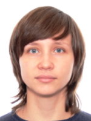

# Natalya Solovyeva


## Contacts
* **Location:** Yekaterinburg, Russia
* **Phone:** +7 912 695 83 63
* **Email:** ns-66@yandex.ru
* **GitHub:** ansee66
* **Discord:** Natalya Solovyeva (@ansee66)

## About Me
I am a marketer by education and have worked in this field most of the time. But over the past year or two, I have been increasingly interested in frontend development and I am studying it as much as possible.

Several things are important to me in my work:
* so that I would be interested in what I do;
* the opportunity to develop and grow in this area;
* the ability to work remotely (because I like to visit and sometimes live in different places).

I think web development is an area that satisfies all these points, and RS School is a very cool opportunity to improve my knowledge and skills in the front end, which is why I'm here.

## Skills
* HTML
* CSS / SASS / SCSS
* BEM
* Git
* Figma, Photoshop
* JavaScript (Basic)
* Editors: Sublime, VSCode, PhpStorm

## Code Example

```
function isDivideBy(number, a, b) {
    if (number % a === 0 & number % b === 0) return true;
    else return false;
}
```

## Experience
At the moment I have little experience in frontend development: I've been working as an HTML coder for about a month.

## Completed projects
[Cat Energy](https://github.com/ansee66/1491863-cat-energy-21 "Source code of adaptive layout training project")

## Education
* **University:** Ural Federal University, marketing
* **Intensive course:** "HTML & CSS. Adaptive Website Coding and Automation" at HTML Academy
* **Interactive course:** "Basic JavaScript" at FreeCodeCamp

## English
English level - A2
